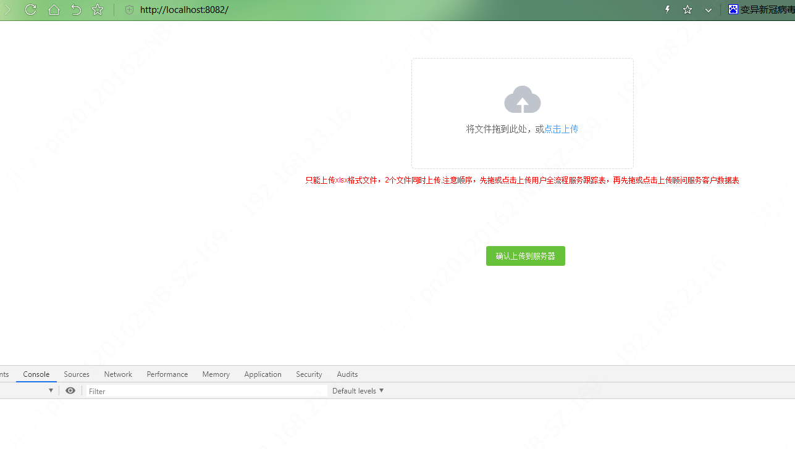

# import-excel-web



## Project setup
```
npm install
```

### Compiles and hot-reloads for development
```
npm run serve
```

### Compiles and minifies for production
```
npm run build
```

### Lints and fixes files
```
npm run lint
```

### Customize configuration
See [Configuration Reference](https://cli.vuejs.org/config/).

### Nginx/Openresty配置
```shell script
...省略...
server {
        listen       8082;
        server_name  localhost;
		
		 location / {
            root   html/dist;
			try_files $uri $uri/ /index.html;
        }
}
...省略...
```